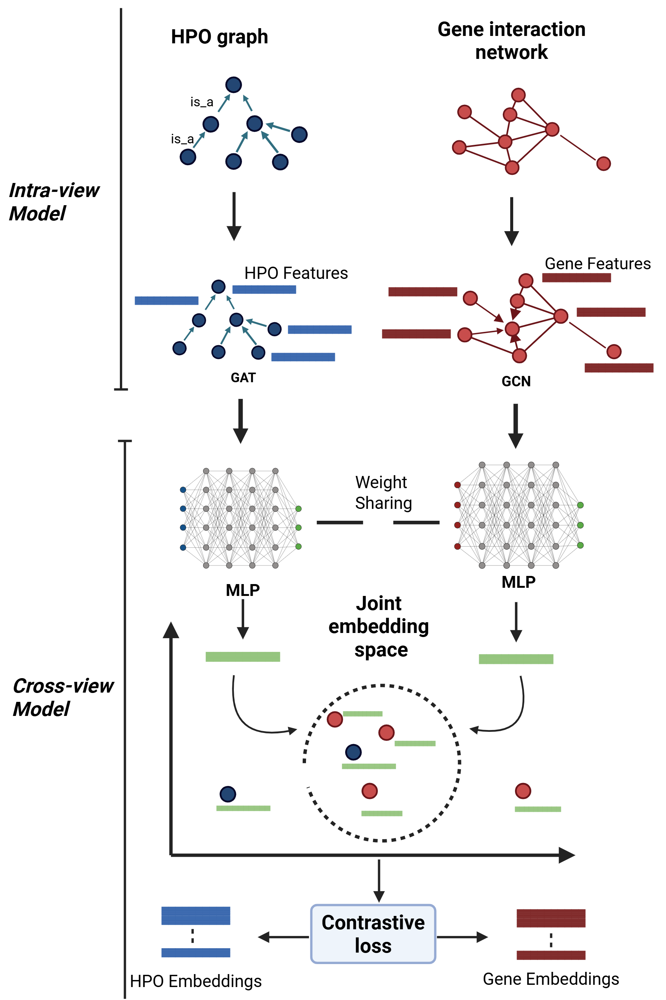

## PhenoGnet

arXiv: 2509.14037 ([https://arxiv.org/abs/2509.14037](https://arxiv.org/abs/2509.14037))
License: MIT ([https://opensource.org/licenses/MIT](https://opensource.org/licenses/MIT))

This repository contains the official implementation for PhenoGnet, a novel graph-based contrastive learning framework designed to predict disease similarity.

PhenoGnet integrates gene functional interaction networks and the Human Phenotype Ontology (HPO) to learn powerful embeddings for genes and phenotypes. By aligning these two views, the model can compute disease similarity scores that capture complex biological relationships, outperforming existing state-of-the-art methods.
---

## Framework Overview

<p align="center">
  
</p>

*Figure: Overall workflow of the PhenoGnet framework integrating gene and phenotype graphs through contrastive learning.*

---
Model Architecture

PhenoGnet consists of two key components: an Intra-view Model to encode the gene and phenotype graphs separately, and a Cross-view Model to align them in a shared latent space.

1.  Intra-view Model:

      * Gene Network: A Graph Convolutional Network (GCN) is used to encode the gene functional interaction network (from HumanNet).
      * Phenotype Network: A Graph Attention Network (GAT) is used to encode the Human Phenotype Ontology (HPO) graph. The initial features for HPO terms are generated from their textual descriptions using Sentence-BERT (all-mpnet-base-v2).

2.  Cross-view Model:

      * A shared-weight multilayer perceptron (MLP) projects the embeddings from both the GCN and GAT into a common latent space.
      * Contrastive learning is applied to train the entire model. Known gene-phenotype associations are used as positive pairs, and randomly sampled unrelated pairs serve as negatives. This process "pulls" related gene and phenotype embeddings closer together and "pushes" unrelated ones apart.

3.  Disease Similarity Prediction:

      * Diseases are represented by the mean embedding (average-pooling) of their associated genes and/or phenotypes.
      * The similarity between any two diseases is calculated using the cosine similarity of their final embedding vectors.

## Installation

The project has been tested with Python 3.10. A virtual environment is recommended
so that the pinned scientific and PyTorch dependencies do not conflict with other
Python projects on your machine.

The requirements are split into a base file plus one PyTorch/PyG profile:

- `requirements.txt`: shared Python dependencies.
- `requirements-torch-cpu.txt` and `requirements-pyg-cpu.txt`: CPU-only install.
- `requirements-torch-cu121.txt` and `requirements-pyg-cu121.txt`: CUDA 12.1 install for NVIDIA GPUs.

Choose either the CPU profile or the CUDA profile for a given virtual environment.
If you switch profiles later, recreating `.venv` is usually the cleanest option.

1. Clone the repository:

    ```bash
    git clone git@github.com:masino-lab/PhenoGnet.git
    cd PhenoGnet
    ```

2. Create a virtual environment:

    ```bash
    python -m venv .venv
    ```

3. Activate the environment.

    On Windows PowerShell:

    ```powershell
    .\.venv\Scripts\Activate.ps1
    ```

    If PowerShell blocks activation scripts, run this once for the current shell
    and then activate again:

    ```powershell
    Set-ExecutionPolicy -Scope Process -ExecutionPolicy Bypass
    .\.venv\Scripts\Activate.ps1
    ```

    On Linux/macOS:

    ```bash
    source .venv/bin/activate
    ```

4. Upgrade pip and packaging tools:

    ```bash
    python -m pip install --upgrade pip setuptools wheel
    ```

5. Install the shared dependencies:

    ```bash
    python -m pip install -r requirements.txt
    ```

6. Install one PyTorch/PyG profile.

    For CPU-only installs on Windows or Linux:

    ```bash
    python -m pip install -r requirements-torch-cpu.txt
    python -m pip install -r requirements-pyg-cpu.txt
    ```

    For NVIDIA GPU installs with CUDA 12.1 wheels on Windows or Linux:

    ```bash
    python -m pip install -r requirements-torch-cu121.txt
    python -m pip install -r requirements-pyg-cu121.txt
    ```

    You do not need to install the CUDA Toolkit separately for these pip wheels,
    but your NVIDIA driver must be new enough for CUDA 12.1. Run `nvidia-smi` to
    confirm that your GPU and driver are visible. CUDA is not supported on macOS.

7. Verify the installation:

    ```bash
    python -m pip check
    python -c "import torch, torch_geometric, torch_scatter, torch_sparse; print('torch', torch.__version__); print('torch cuda', torch.version.cuda); print('cuda available', torch.cuda.is_available()); print('pyg', torch_geometric.__version__); print('scatter', torch_scatter.__version__); print('sparse', torch_sparse.__version__)"
    ```

    CPU installs should report `cuda available False`. CUDA installs should report
    `cuda available True`; if not, confirm that the active interpreter is the repo
    virtual environment (`.venv\Scripts\python.exe` on Windows or `.venv/bin/python`
    on Linux/macOS).

## Citation

If you use this code or our work, please cite the paper:

```
@misc{baminiwatte2025phenognet,
title={PhenoGnet: A Graph-Based Contrastive Learning Framework for Disease Similarity Prediction},
author={Ranga Baminiwatte and Kazi Jewel Rana and Aaron J. Masino},
year={2025},
eprint={2509.14037},
archivePrefix={arXiv},
primaryClass={q-bio.GN}
}
```

## Acknowledgments

This work was supported by the NIH funded Center of Biomedical Research Excellence in Human Genetics at Clemson University.

## License

This project is licensed under the MIT License - see the LICENSE file for details.
